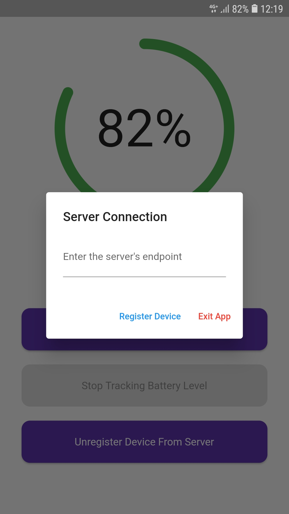
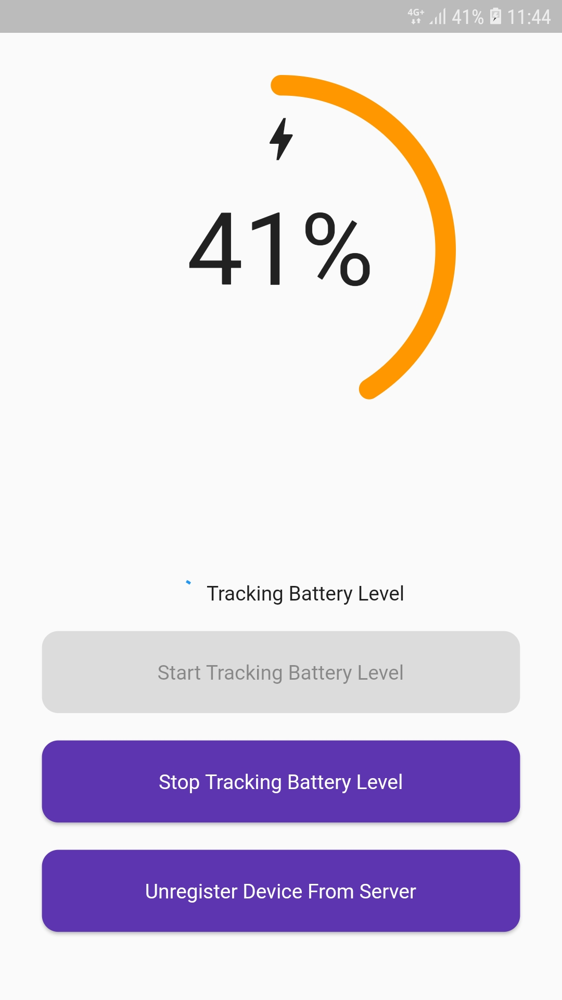

# AndroidBatteryTracker

[BatteryTrackerServer](https://github.com/TryingOutSomething/BatteryTrackerServer) is a service that reduces the
possibility of overcharging your device by tracking its battery level periodically.

This repository contains the mobile app client of
the [BatteryTrackerServer](https://github.com/TryingOutSomething/BatteryTrackerServer) service.

**NOTE:** This project **only works on Android**. It **does not support iOS** due to background task restrictions.

|  |  |
|:-----------------------------------------------------|:-----------------------------------------------------|

## Features

- Register device to server
- Periodically send device's information (`device id`, `name` & `battery level`) to the server via REST API (Works in
  foreground & background)
- Unregister device to server

The app **MUST** first register itself to the server before it can periodically send the device's information to the
server.

The app also requires the following permission to work in the backgorund:

| Permission                             |
|:---------------------------------------|
| `WAKE_LOCK`                            |
| `FOREGROUND_SERVICE`                   |
| `REQUEST_IGNORE_BATTERY_OPTIMIZATIONS` |

The app will **not work properly** if these permissions are not enabled.

Before closing the app, it is recommended to stop the sending service because it will continue to run in the background.

You can kill the app using the recent apps option for good measure as well.

## Run Locally

Clone the project

```bash
  git clone https://github.com/TryingOutSomething/AndroidBatteryTracker
```

Go to the project directory

```bash
  cd AndroidBatteryTracker
```

Install dependencies

```bash
  flutter pub get
```

Start the app

```bash
  flutter run
```

## Deployment

To build an apk version of the app, refer to [the official document](https://docs.flutter.dev/deployment/android)
provided by Flutter

## Contributing

Feel free to edit the project and submit a pull request or open an issue on github to leave a feedback

## License

[MIT](https://choosealicense.com/licenses/mit/)

## Attributions

Icons used to create the logo:

- [Made by Premium](https://www.flaticon.com/authors/made-by-made-premium) from [FlatIcons](https://www.flaticons.com)
- [DinosoftLabs](https://www.flaticon.com/authors/dinosoftlabs) from [FlatIcons](https://www.flaticons.com)